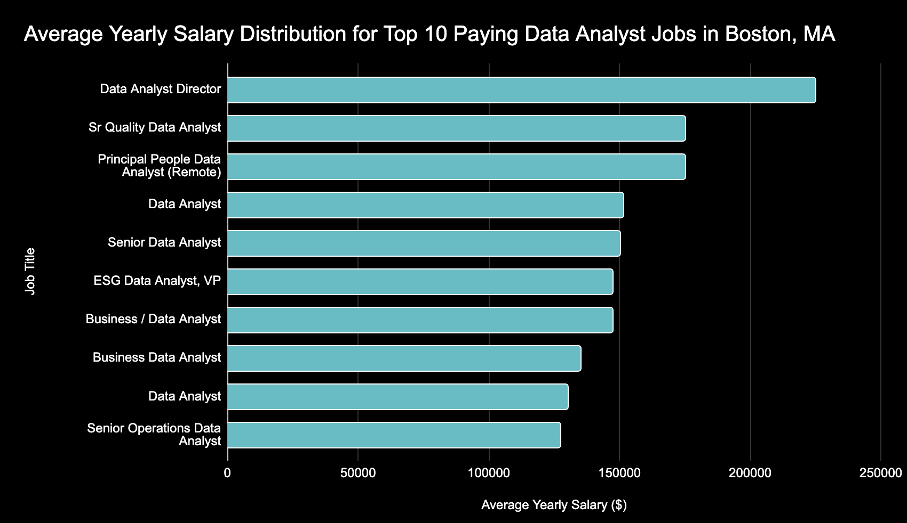
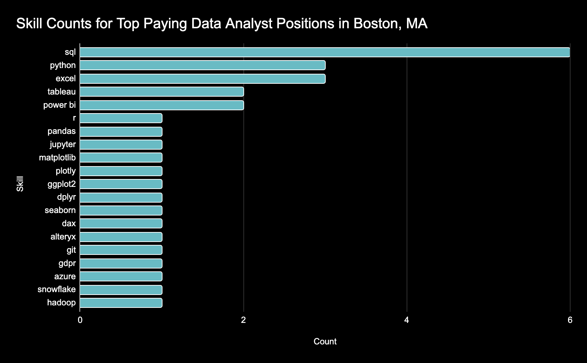
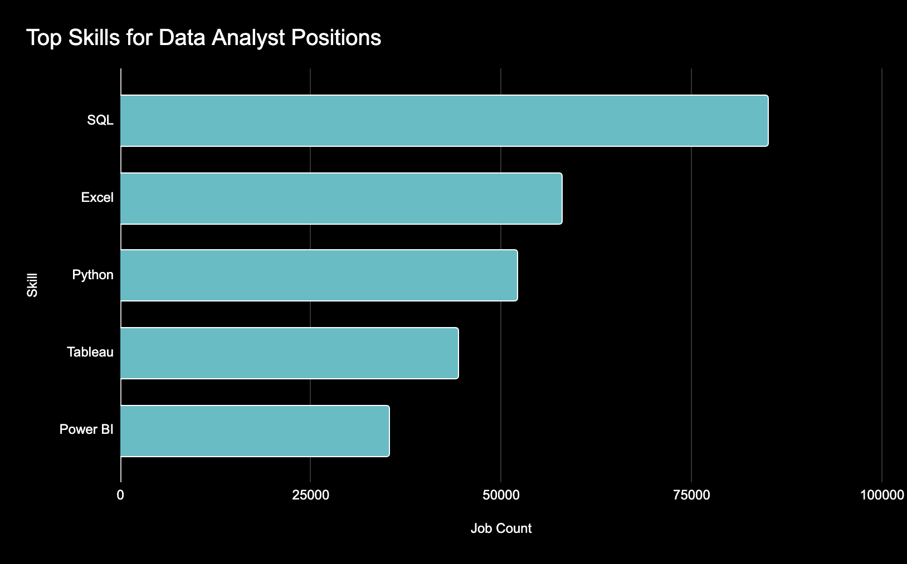
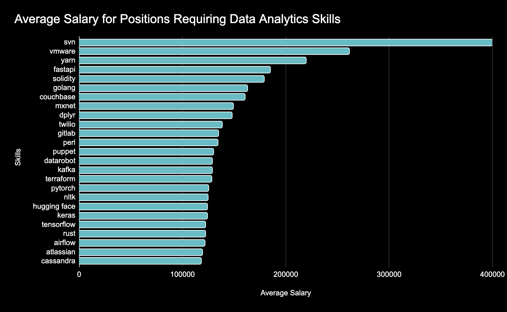
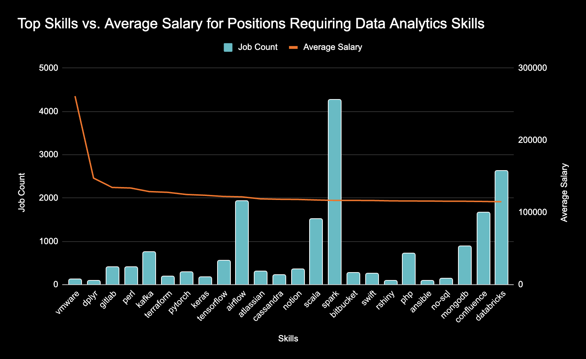

# Introduction
This repository contains SQL-based data analysis focused on exploring trends in the data analyst job market. Using data from online job postings, the project examines job titles, salaries, locations, essential skills, and the relationship between skills and compensation.
# Background
I aimed to answer the following questions through each one of my queries:
1. What are the top paying Data Analyst positions in Boston, Massachusetts?
2. What are the neccessary skills for these jobs?
3. What are the most highly demanded skills for Data Analysts?
4. Which skills are associated with higher average salaries for Data Analysts?
5. What are the most optimal skills to learn for Data Analysts?
# Tools
- SQL: Queried and analyzed large datasets using joins, CTEs, and aggregations to extract insights from job market data.
- PostgreSQL: Database management system that was used for handling job posting data.
- VSCode: Used as the primary development environment for writing SQL, managing files, and handling version control with Git.
# Analysis
### Query 1
This query filters job postings based on location and average yearly salary. The bar chart below shows the distribution of yearly salaries among the positions that were identified as high paying in Boston, MA.
```sql
SELECT
    job_title,
    job_location,
    salary_year_avg,
    name AS company_name
FROM
    job_postings_fact
LEFT JOIN company_dim ON job_postings_fact.company_id = company_dim.company_id
WHERE
    job_location LIKE '%Boston%' AND
    job_title LIKE '%Data Analyst%' AND
    salary_year_avg IS NOT NULL
ORDER BY
    salary_year_avg DESC
LIMIT 10
```
\
 

The data shows that a correlation exists between the compensation an analyst receives and their level of experience and specialization. Data Analyst Director tops the list for analyst salaries at $225,000 due to its leadership responsibilities and the strategic oversight required. Senior level and specialized positions have a clustered salary range between $150,000 and $175,000. Examples of these types of positions are Sr Quality Data Analyst, Principal People Data Analyst, and ESG-focused positions. Overall, the salary growth is driven by experience, leadership, and specialization in the field of analytics. The average salaries for mid-level Analyst positions were reported to have ranges between $130,000 and $151,500; thus solid earning potential exists for those who occupy non-executive roles as well.

### Query 2

This query uses the positions that were found as high paying from the previous query and identifies the skills that are required for each. The bar chart below shows the counts for each skill.

```sql
WITH top_da_boston_jobs AS (
    SELECT
        job_id,
        job_title,
        job_location,
        salary_year_avg,
        name AS company_name
    FROM
        job_postings_fact
    LEFT JOIN company_dim ON job_postings_fact.company_id = company_dim.company_id
    WHERE
        job_location LIKE '%Boston%' AND
        job_title LIKE '%Data Analyst%' AND
        salary_year_avg IS NOT NULL
    ORDER BY
        salary_year_avg DESC
    LIMIT 10
)

SELECT
    top_da_boston_jobs.*,
    skills_dim.skills
FROM 
    top_da_boston_jobs
INNER JOIN skills_job_dim ON top_da_boston_jobs.job_id = skills_job_dim.job_id
INNER JOIN skills_dim ON skills_job_dim.skill_id = skills_dim.skill_id
ORDER BY
    top_da_boston_jobs.salary_year_avg DESC;
```
\
 

The top skills for these positions include **SQL**, **Python**, and **Excel**, which are all core tools for data analytics and data management. Other important skills include **Tableau** and **Power BI** which are powerful data visualization tools.

### Query 3

This query looks at the most demanded skills among all Data Analyst roles. The bar chart below shows the number of job postings that require each skill.

```sql
SELECT 
    skills,
    COUNT(skills_job_dim.job_id) AS job_count
FROM 
    job_postings_fact
INNER JOIN skills_job_dim ON job_postings_fact.job_id = skills_job_dim.job_id
INNER JOIN skills_dim ON skills_job_dim.skill_id = skills_dim.skill_id
WHERE 
    job_title LIKE '%Data Analyst%'
GROUP BY
    skills
ORDER BY
    job_count DESC
LIMIT 5
```
\


Among all Data Analyst roles, the top demanded skills remain the same as seen in the previous query. Again, **SQL** is the most demanded skill because of its usefulness with interacting with relational databases

### Query 4

This query identifies the skills that are associated with the highest average salary among Data Analyst roles. The bar chart below shows each skill and the corresponding average salary of all roles that require it.

```sql
SELECT 
    skills,
    ROUND(AVG(job_postings_fact.salary_year_avg), 0) AS avg_salary
FROM 
    job_postings_fact
INNER JOIN skills_job_dim ON job_postings_fact.job_id = skills_job_dim.job_id
INNER JOIN skills_dim ON skills_job_dim.skill_id = skills_dim.skill_id
WHERE 
    job_title_short LIKE '%Data Analyst%' AND
    salary_year_avg IS NOT NULL
GROUP BY
    skills
ORDER BY
    avg_salary DESC
LIMIT 25
```
\


The top-paying skills in this dataset include **SVN**, **VMware**, and **YARN**, which are specialized tools for version control, virtualization, and big data management, respectively. These skills are highly valued in engineering and infrastructure roles, reflected by their high average salaries.

Other notable skills include **FastAPI** and **Solidity**, which are used in web development and blockchain programming, indicating strong demand for modern software development expertise.

Skills like **Golang**, **Couchbase**, and **MXNet** highlight expertise in backend programming, database management, and machine learning frameworks, while **Dplyr**, **PyTorch**, and **TensorFlow** are key for data manipulation and machine learning workflows.

Overall, the dataset shows a mix of infrastructure, programming, and AI/ML skills, with the top salaries concentrated in tools that are specialized, high-demand, and technical, rather than general-purpose.

### Query 5

This query uses skills associated with higher average salaries from the previous query combined with skill demand to identify the most optimal skills to learn for Data Analysts. The combo chart below shows the number of positions requiring each skill as well as the average salary for all positions requiring that skill.

```sql
WITH skills_job_counts AS (
    SELECT 
        skills_dim.skill_id,
        skills_dim.skills,
        COUNT(skills_job_dim.job_id) AS job_count
    FROM 
        job_postings_fact
    INNER JOIN skills_job_dim ON job_postings_fact.job_id = skills_job_dim.job_id
    INNER JOIN skills_dim ON skills_job_dim.skill_id = skills_dim.skill_id
    WHERE 
        job_title LIKE '%Data Analyst%'
    GROUP BY
        skills_dim.skill_id
),

skills_avg_salaries AS (
    SELECT 
        skills_dim.skill_id,
        skills_dim.skills,
        ROUND(AVG(job_postings_fact.salary_year_avg), 0) AS avg_salary
    FROM 
        job_postings_fact
    INNER JOIN skills_job_dim ON job_postings_fact.job_id = skills_job_dim.job_id
    INNER JOIN skills_dim ON skills_job_dim.skill_id = skills_dim.skill_id
    WHERE 
        job_title_short LIKE '%Data Analyst%' AND
        salary_year_avg IS NOT NULL
    GROUP BY
        skills_dim.skill_id
)

SELECT
    skills_job_counts.skills,
    skills_job_counts.job_count,
    skills_avg_salaries.avg_salary
FROM
    skills_job_counts
INNER JOIN skills_avg_salaries ON skills_job_counts.skill_id = skills_avg_salaries.skill_id
WHERE
    skills_job_counts.job_count >= 50
ORDER BY
    skills_avg_salaries.avg_salary DESC,
    skills_job_counts.job_count DESC
LIMIT 25
```
\


The average salary line shows a steep increase among the top skills, indicating that highly specialized skills command significantly higher compensation. As job demand increases, the salary trend drops sharply and then begins to flatten, suggesting diminishing salary returns for more common skills. This pattern highlights a trade-off where specialization drives higher pay, while widely demanded skills offer stability rather than premium compensation.